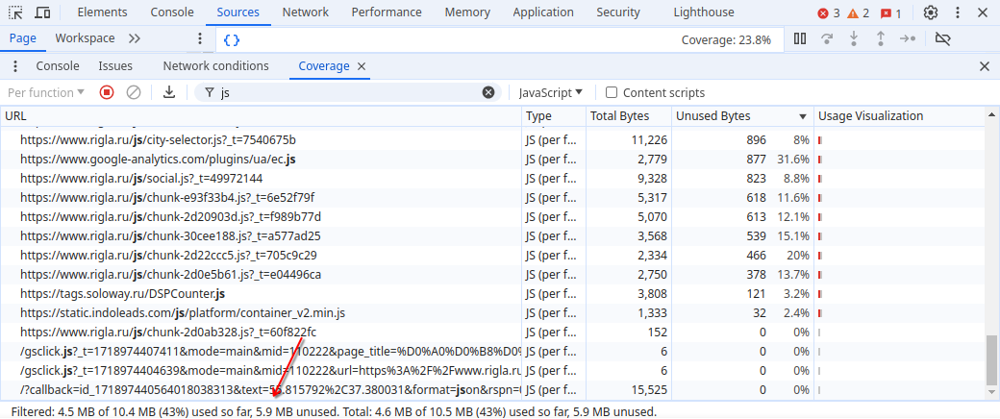
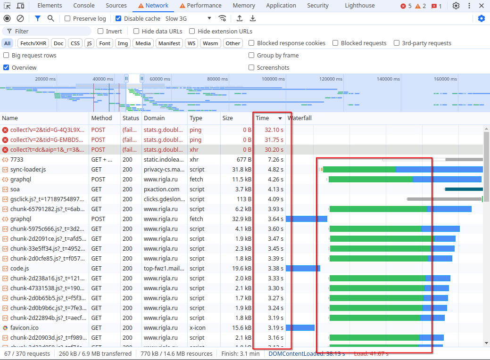

# Анализ с помощью Chrome DevTools страницы rigla.ru

В данном проекте нужно проанализировать веб-страницу и дать рекомендации по ее оптимизации.

## Подготовка:

Страница открыта в режиме Инкогнито, для предотвращения нагрузки от сторонних плагинов браузера Chromium. На вкладке `Network` отключен cache, что эмулирует первый заход пользователя на страницу, когда у него пустой кэш.

## Network:

1. Для начала записал `network.har`, HAR архив профиль загрузки ресурсов при открытии страницы. Файлы HAR (HTTP Archive) фиксируют различные проблемы браузера, такие как неудачные входы и проблемы с отображением веб-страниц.

2. Поиск неоптимальных мест:

   - Дублирование ресурсов. Вел поиск полных соответствий `name, url, параметров headers`.

     Два одинаковых запроса, требующих высокий уровень степени защиты:
     

     `graphql` — кэшируется 12 раз с разными тэгами, причем `FPC` — полный кэш страницы:
     

     Меняется только порядок правил доступа CORS к ресурсам между доменами — `tp2` 3 запроса:
     

     Попарно одинаковые запросы на Google Fonts:
     

     Каждый `.jpeg` и `.png` на странице запрашивается по 2 раза:
     

   - Лишний размер ресурсы, чаще всего `.png` и `.jpeg` форматы, которые можно сжать, поиск по размеру Size выше 10kB:

     

     Сюда можно отнести неиспользуемые js файлы:
     
     

   - Медленно загружающиеся ресурсы, замедляют общую производительность. Это контент с большим ожиданием ответа от сервера, зеленая шкала `Waterflow`:

     

   - Ресурсы, блокирующие загрузку. В `Waterflow` обозначены серой шкалой `Stalled`:

     

     Скрипты от Яндекс, Google и от других сторонних источников также блокируют основной поток:
     
     

3. Другие не оптимальности, заблокированный запрос политикой CORS, ошибка доступа, доступ к геолокации отклонен, неудачная попытка создания WebGPU, неудачная попытка парса видео:

   
   

## Performance

1. Записал файл загрузки `performance.json`.

2. Время в миллисекундах от начала навигации до событий (шкала `Timings`):

   

   - First Paint (FP) – когда пользователь впервые что-то увидел, `2362.2 ms`
   - First Contentful Paint (FCP) – когда браузер отображает первый элемент содержимого (текст, изображение, SVG, не пустой canvas), `2362.2 ms`
   - Largest Contentful Paint (LCP) – время, необходимое для отображения на экране наибольшего элемента содержимого (изображение, текстовый блок и т.д.) при первом загрузке страницы, `6513.6 ms`
   - DOM Content Loaded (DCL) – показывает, когда основной контент страницы готов к взаимодействию, `1863.8 ms`
   - Load (L) – страница полностью загружена, `6720.2 ms`

3. LCP происходит на DOM-элементе `img.popup-metadata-type-slider__img`:

   

4. Сколько времени в миллисекундах тратится на разные этапы обработки документа (шкала Main, Summary):

   

   - Loading, 23ms
   - Scripting, 2816 ms
   - Rendering, 323 ms
   - Painting, 112 ms

## Coverage

1. Вкладка Coverage после загрузки страницы:

   

2. Объём в Кб неиспользованного CSS в ходе загрузки страницы — 45,4 Кб:
   

3. Объём в Кб неиспользованного JS в ходе загрузки страницы — 5900 Кб:
   

# Анализ с помощью Chrome DevTools замедленной страницы rigla.ru

Этот анализ со включенным замедлением CPU 4x slowdown и эмуляцией сети Slow 3G.

## Подготовка:

Страница открыта в режиме Инкогнито, для предотвращения нагрузки от сторонних плагинов браузера Chromium. На вкладке Network отключен cache, что эмулирует первый заход пользователя на страницу, когда у него пустой кэш. Во вкладке Performance выставлены значения троттлинга Slow 3G и CPU 4x slowdown.

## Network

Увеличилось время для загрузки ресурсов, еще больше замедлилась общая производительность страницы.

Увеличилось время блокировки ресурсов, также добавился новый запрос `7733`.

## Performance

1. Записал новый файл загрузки performance-slowed.json

2. Время в миллисекундах от начала навигации до событий (шкала `Timings`) значительно увеличилось:

   

   - First Paint (FP) – когда пользователь впервые что-то увидел, `26441.4 ms`
   - First Contentful Paint (FCP) – когда браузер отображает первый элемент содержимого (текст, изображение, SVG, не пустой canvas), `26441.4 ms`
   - Largest Contentful Paint (LCP) – время, необходимое для отображения на экране наибольшего элемента содержимого (изображение, текстовый блок и т.д.) при первом загрузке страницы, `26441.4 ms`
   - DOM Content Loaded (DCL) – показывает, когда основной контент страницы готов к взаимодействию, `38115.6 ms`
   - Load (L) – страница полностью загружена, `41673.2 ms`

   * Рендеры LCP и DCL поменялись местами

3. LCP происходит на DOM-элементе `img`:

   

4. Сколько времени в миллисекундах тратится на разные этапы обработки документа (шкала Main, Summary):

   

   - Loading, 33ms
   - Scripting, 4160 ms
   - Rendering, 99 ms
   - Painting, 34 ms
